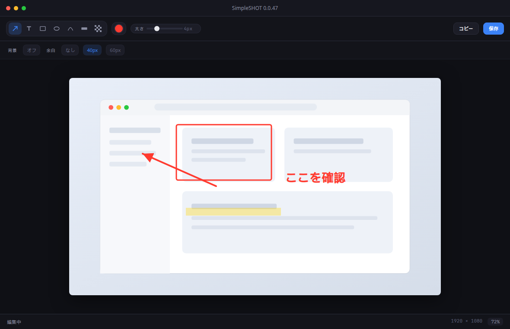

# Pashatt（パシャッ）

macOS 向けのスクリーンショット & アノテーションツール。

スクショ撮って、ちょっとだけアノテーションして、すぐに共有できる。軽量でシンプルなスクショアプリです。

  

メニューバーに常駐します。デフォルトは `⌘⇧Space` でキャプチャ開始（設定で変更可）。

アプリは無料です。

## 機能

### キャプチャ
- **範囲選択** — ドラッグで矩形を指定
- **全画面** — クリックで画面全体を撮影
- **ウィンドウ選択** — `Space` で前面の見えるウィンドウを選択
- 撮影直後にクリップボードへ自動コピー → エディタで編集

### アノテーション
- 矢印（均一 / テーパー）・テキスト・矩形・楕円・ペン・ハイライト・モザイク
- トリミング・パン / ズーム・元に戻す / やり直す
- カラーピッカー・スポイト・お気に入り色
- 背景色・余白・角丸

### 書き出し
- クリップボードへコピー / ファイル保存
- PNG / JPEG、保存先フォルダ、カーソルの有無を設定可能

### 設定
- テーマ（システム / ライト / ダーク）
- 言語（システム / English / 日本語）
- グローバルホットキーのカスタマイズ
- スクリーン録画・アクセシビリティ権限の確認とシステム設定への導線
- OTA アップデート（起動時チェック / トレイ・設定から「アップデートを確認…」）

### 履歴
- キャプチャを自動でローカル履歴に保存
- トレイ「履歴」から直近を選んでクリップボードへコピー

## 使い方

1. アプリを起動するとメニューバーに常駐します
2. `⌘⇧Space`（またはトレイメニュー）でキャプチャ開始
3. 範囲 / 全画面 / ウィンドウを選ぶ
4. エディタでアノテーション → **コピー** または **保存**

必要な権限:
- **スクリーン録画** — キャプチャに必須
- **アクセシビリティ** — グローバルホットキーに必須

## ライセンス

MIT

## その他

もし気に入ってくれたら [Buy Me a Coffee](https://buymeacoffee.com/naotok705) でコーヒーをおごってもらえるとうれしいです。

---

# Pashatt

A lightweight screenshot & annotation app for macOS.

Capture, add a quick annotation, and share — nothing more than you need.

  

It lives in the menu bar. Press `⌘⇧Space` to start a capture (customizable in Settings).

Pashatt is free.

## Features

### Capture
- **Region** — drag to select
- **Full screen** — click to capture the whole display
- **Window** — press `Space` to pick a visible frontmost window
- Auto-copies to the clipboard, then opens the editor

### Annotation
- Arrow (uniform / tapered), text, rectangle, ellipse, pen, highlighter, mosaic
- Crop, pan / zoom, undo / redo
- Color picker, eyedropper, favorite colors
- Background color, padding, and corner radius

### Export
- Copy to clipboard or save to disk
- PNG / JPEG, save folder, and optional cursor capture

### Settings
- Theme (System / Light / Dark)
- Language (System / English / Japanese)
- Customizable global hotkey
- Screen Recording & Accessibility permission checks with links to System Settings

## How to use

1. Launch the app — it stays in the menu bar
2. Press `⌘⇧Space` (or use the tray menu) to start a capture
3. Choose region, full screen, or a window
4. Annotate in the editor, then **Copy** or **Save**

Required permissions:
- **Screen Recording** — required for capture
- **Accessibility** — required for the global hotkey

## License

MIT

## Other

If you like it, you can [buy me a coffee](https://buymeacoffee.com/naotok705) — optional.
